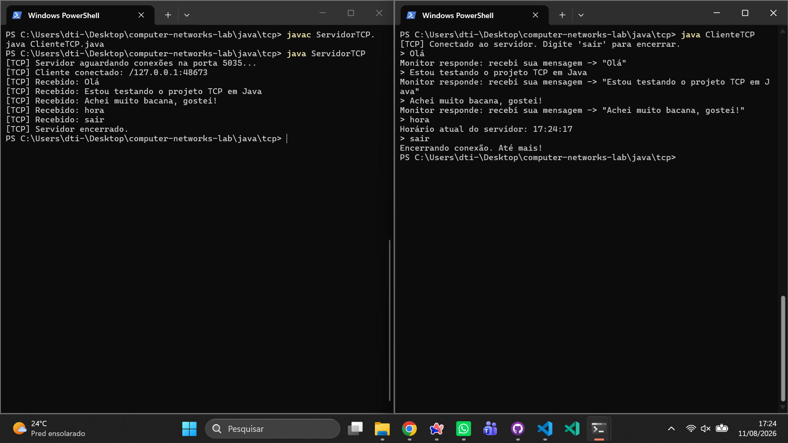
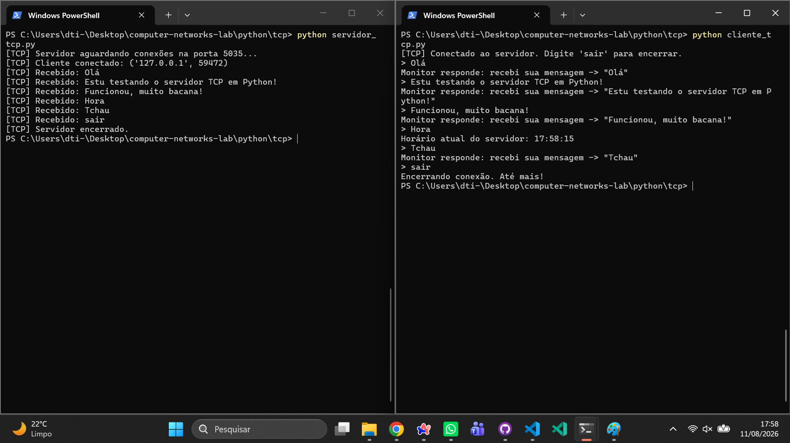
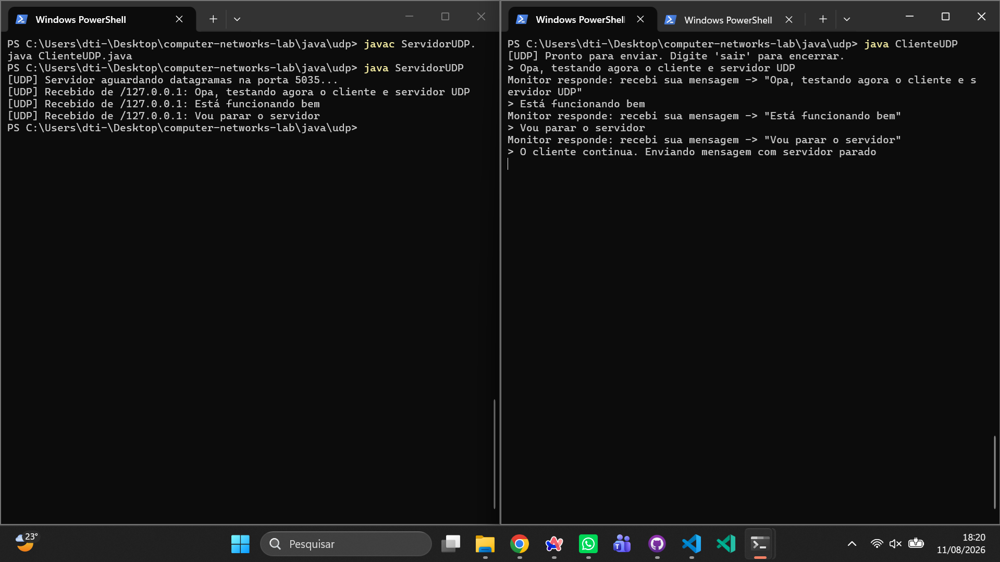
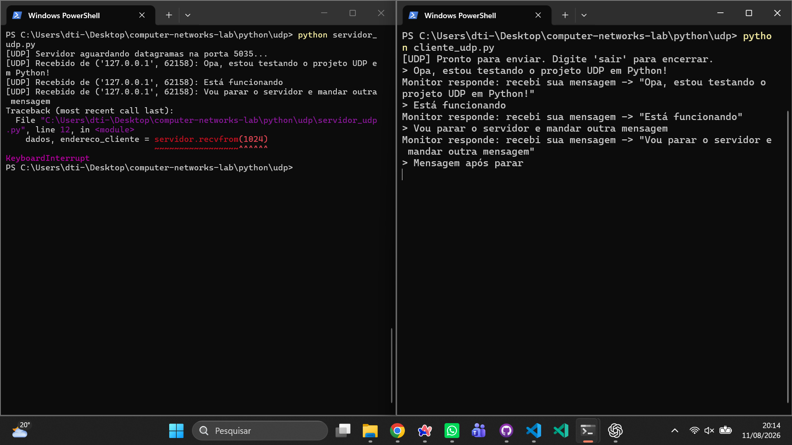
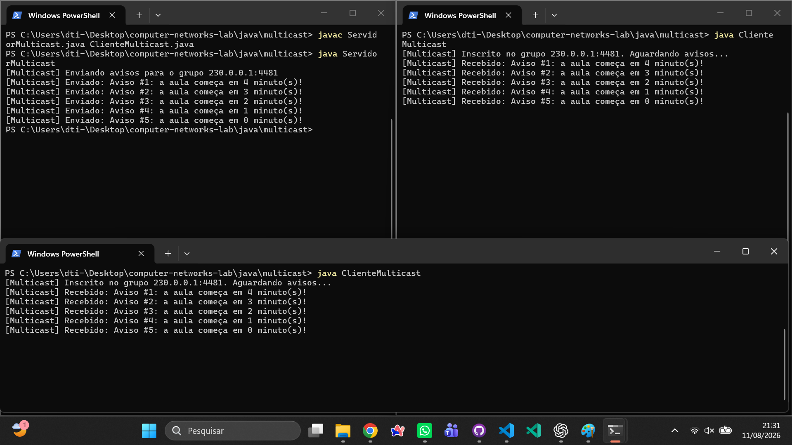
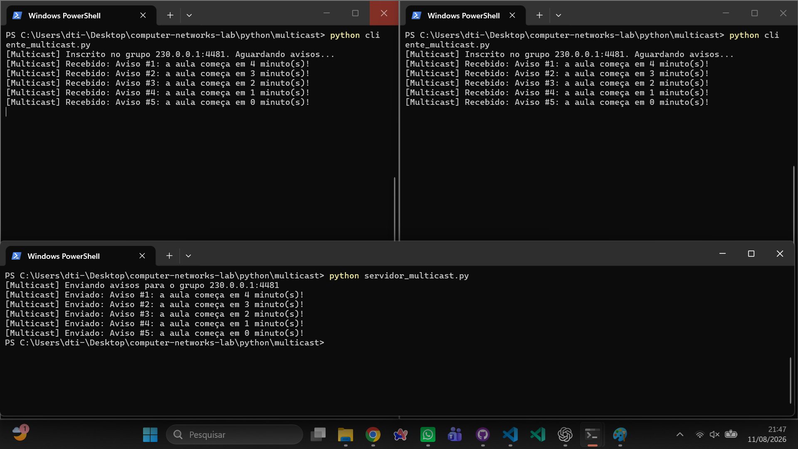
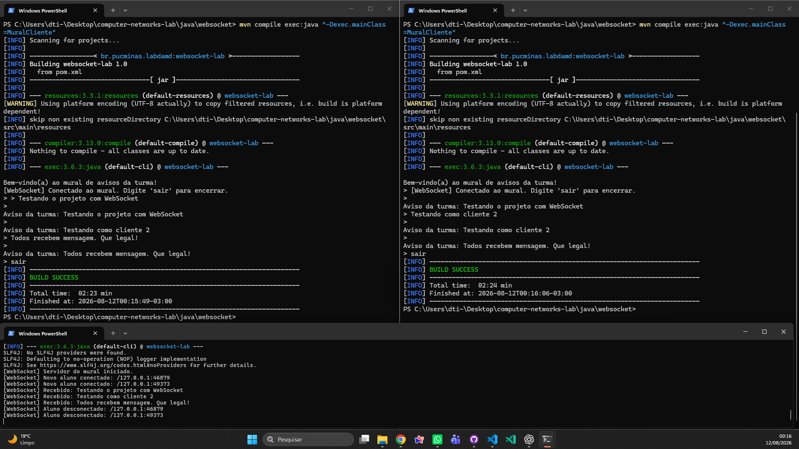
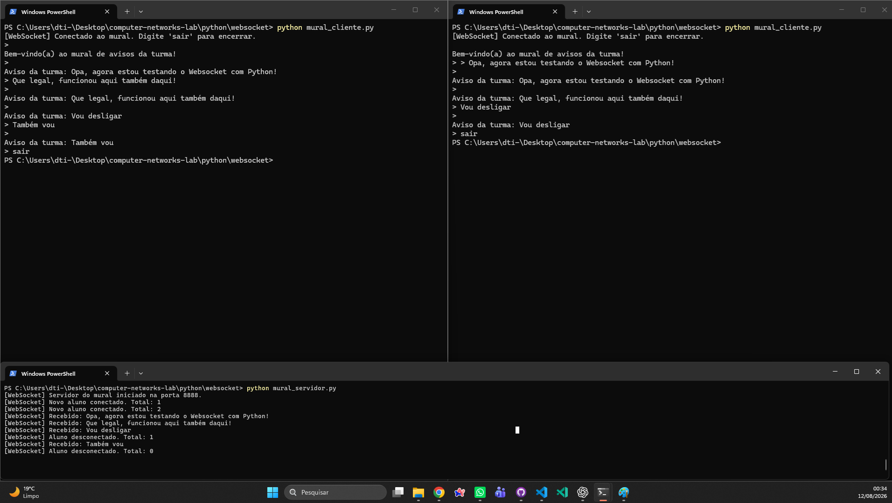

# Central de Avisos da Turma

Laboratório prático de revisão de Redes de Computadores: o mesmo cenário de comunicação implementado quatro vezes (TCP, UDP, Multicast e WebSocket), cada uma em Java e em Python, para comparar na prática como cada protocolo se comporta.


---

## 🚧 Status do Projeto

Laboratório concluído: as quatro partes (TCP, UDP, Multicast e WebSocket) estão implementadas e testadas em Java e em Python, com evidências de execução e respostas conceituais registradas.

---

## 📚 Índice

- [Central de Avisos da Turma](#central-de-avisos-da-turma)
  - [🚧 Status do Projeto](#-status-do-projeto)
  - [📚 Índice](#-índice)
  - [📝 Sobre o Projeto](#-sobre-o-projeto)
  - [✨ Funcionalidades Principais](#-funcionalidades-principais)
  - [🛠 Tecnologias Utilizadas](#-tecnologias-utilizadas)
  - [🏗 Arquitetura](#-arquitetura)
  - [⚙️ Instalação e Execução](#️-instalação-e-execução)
    - [Pré-requisitos](#pré-requisitos)
    - [🔌 Parte A: TCP](#-parte-a-tcp)
    - [📡 Parte B: UDP](#-parte-b-udp)
    - [📢 Parte C: Multicast](#-parte-c-multicast)
    - [💬 Parte D: WebSocket](#-parte-d-websocket)
  - [📂 Estrutura de Pastas](#-estrutura-de-pastas)
  - [🖼️ Evidências](#️-evidências)
  - [📖 Referências](#-referências)
  - [🤖 Uso Responsável de IA](#-uso-responsável-de-ia)
  - [🙏 Agradecimentos](#-agradecimentos)
  - [👤 Autor](#-autor)
  - [📄 Licença](#-licença)

---

## 📝 Sobre o Projeto

Este repositório reúne a resolução do **Roteiro 2** da disciplina **Laboratório de Desenvolvimento de Aplicações Móveis e Distribuídas**, do curso de Engenharia de Software da **PUC Minas**, cujo enunciado completo está em [`enunciado/roteiro-2.md`](enunciado/roteiro-2.md).

O objetivo do roteiro é revisar, na prática, os fundamentos de redes de computadores e sistemas operacionais que servem de base para o restante da disciplina. Para isso, um único cenário fictício, uma **central de avisos da turma**, é implementado quatro vezes, uma para cada protocolo de comunicação:

| Parte | Protocolo | O que representa no cenário                                                                   |
| :---: | :-------: | :-------------------------------------------------------------------------------------------- |
|   A   |    TCP    | Um aluno pergunta algo ao monitor e recebe uma resposta direta (conversa privada e confiável) |
|   B   |    UDP    | O mesmo pedido, mas sem garantia de entrega (mensagem "solta" na rede)                        |
|   C   | Multicast | O professor avisa todos os alunos inscritos em um grupo, de uma só vez                        |
|   D   | WebSocket | Um mural de avisos em tempo real, ao qual vários alunos ficam conectados simultaneamente      |

Cada uma dessas quatro partes foi implementada tanto em **Java** quanto em **Python**, o que permite comparar diretamente o que muda (e o que não muda) entre as duas linguagens ao resolver exatamente o mesmo problema de rede. As doze perguntas conceituais propostas pelo roteiro, três por parte, foram respondidas em [`RESPOSTAS.md`](RESPOSTAS.md), sempre com base no comportamento observado ao testar o próprio código.

---

## ✨ Funcionalidades Principais

- Conversa privada e confiável entre aluno e monitor via TCP, incluindo o comando `hora`, que devolve o horário atual do servidor em vez do eco padrão
- Envio de mensagens via UDP, sem garantia de entrega, evidenciando o que acontece quando o servidor está fora do ar
- Avisos de multicast enviados uma única vez pelo servidor e recebidos ao mesmo tempo por todos os clientes inscritos no grupo `230.0.0.1`
- Mural de avisos em tempo real via WebSocket, com broadcast automático de cada mensagem para todos os alunos conectados
- As quatro soluções implementadas de forma independente em Java e em Python, usando a biblioteca padrão de sockets de cada linguagem
- Portas configuráveis por um `OFFSET` pessoal, evitando colisão entre colegas testando na mesma rede

---

## 🛠 Tecnologias Utilizadas

- **Java 21 ou superior**: pacote `java.net` (`Socket`, `ServerSocket`, `DatagramSocket`, `MulticastSocket`) e `java.net.http.WebSocket`, todos nativos do JDK
- **Java-WebSocket 1.5.6**: biblioteca usada apenas no servidor WebSocket em Java, gerenciada via **Maven**
- **Python 3.10 ou superior**: módulo `socket` da biblioteca padrão, usado em TCP, UDP e Multicast
- **websockets**: biblioteca Python usada no mural em tempo real (`pip install websockets`)
- **Git**: versionamento do progresso do laboratório em commits pequenos e descritivos

---

## 🏗 Arquitetura

Não existe uma aplicação única neste repositório. São **8 programas independentes** (4 protocolos multiplicados por 2 linguagens), cada um formado por um par cliente e servidor que conversa por sockets, geralmente em `localhost`. Todos reproduzem o mesmo cenário da central de avisos, o que torna as diferenças entre os protocolos visíveis lado a lado:

- **TCP** (`java/tcp`, `python/tcp`): o servidor aceita uma única conexão e troca mensagens de texto linha a linha até o cliente digitar `sair`.
- **UDP** (`java/udp`, `python/udp`): sem conexão prévia, cada mensagem é um datagrama independente, sem confirmação de entrega.
- **Multicast** (`java/multicast`, `python/multicast`): o servidor envia avisos para um endereço de grupo (`230.0.0.1`), e a própria rede replica o pacote para todos os clientes inscritos.
- **WebSocket** (`java/websocket`, `python/websocket`): o servidor mantém uma lista de conexões abertas e faz o broadcast de cada mensagem recebida para todos os clientes conectados.

A organização das pastas segue primeiro a linguagem (`java/`, `python/`) e depois o protocolo, e não existe nenhuma camada de persistência: o estado de cada aplicação vive apenas em memória enquanto os processos estão em execução.

---

## ⚙️ Instalação e Execução

### Pré-requisitos

- **Java JDK 21 ou superior** (`java -version`)
- **Python 3.10 ou superior**, com o Python adicionado ao PATH (`python --version`)
- **Maven 3.8 ou superior** (`mvn -version`), necessário apenas para o servidor WebSocket em Java
- **Git**

> **Firewall do Windows:** na primeira execução de cada servidor, o Firewall do Windows Defender pode exibir um pop-up perguntando se permite a comunicação em rede. Clique em **"Permitir acesso"**, caso contrário o programa continua rodando, mas as mensagens não chegam ao destino.

Cada parte abaixo assume que os comandos são executados a partir da raiz do repositório, em terminais separados para servidor e cliente.

### 🔌 Parte A: TCP

Servidor e cliente conversam em uma conexão contínua na porta `5035`. Digite `hora` para receber o horário do servidor, ou `sair` para encerrar.

**Java:**

```bash
cd java/tcp
javac ServidorTCP.java ClienteTCP.java
java ServidorTCP        # terminal 1
java ClienteTCP         # terminal 2
```

**Python:**

```bash
cd python/tcp
python servidor_tcp.py     # terminal 1
python cliente_tcp.py      # terminal 2
```

### 📡 Parte B: UDP

Mesmo cenário da Parte A, mas sem conexão, também na porta `5035`. Para observar a ausência de garantia de entrega, encerre o servidor com `Ctrl+C` e envie uma mensagem pelo cliente em seguida.

**Java:**

```bash
cd java/udp
javac ServidorUDP.java ClienteUDP.java
java ServidorUDP        # terminal 1
java ClienteUDP         # terminal 2
```

**Python:**

```bash
cd python/udp
python servidor_udp.py     # terminal 1
python cliente_udp.py      # terminal 2
```

### 📢 Parte C: Multicast

O servidor envia 5 avisos para o grupo `230.0.0.1`, na porta `4481`. Abra um ou mais clientes **antes** do servidor, já que o multicast não guarda histórico: quem não estiver inscrito no momento do envio simplesmente perde o aviso (ver [`RESPOSTAS.md`](RESPOSTAS.md)).

**Java:**

```bash
cd java/multicast
javac ServidorMulticast.java ClienteMulticast.java
java ClienteMulticast     # um ou mais terminais, primeiro
java ServidorMulticast    # depois, em outro terminal
```

**Python:**

```bash
cd python/multicast
python cliente_multicast.py     # um ou mais terminais, primeiro
python servidor_multicast.py    # depois, em outro terminal
```

### 💬 Parte D: WebSocket

Mural de avisos em tempo real. O servidor Java escuta na porta `8887` e o servidor Python na porta `8888`; abra dois ou mais clientes para ver o broadcast das mensagens acontecendo entre eles.

**Java:**

```bash
cd java/websocket
mvn compile exec:java -Dexec.mainClass=MuralServidor      # terminal 1
mvn compile exec:java -Dexec.mainClass=MuralCliente        # terminal 2 (e outros)
```

**Python:**

```bash
cd python/websocket
pip install websockets
python mural_servidor.py     # terminal 1
python mural_cliente.py      # terminal 2 (e outros)
```

---

## 📂 Estrutura de Pastas

```
.
├── enunciado/
│   └── roteiro-2.md            # Enunciado completo do laboratório
├── evidencias/                 # Prints de execução de cada protocolo/linguagem
│   ├── tcp/
│   ├── udp/
│   ├── multicast/
│   └── websocket/
├── java/
│   ├── tcp/                    # ServidorTCP.java e ClienteTCP.java
│   ├── udp/                    # ServidorUDP.java e ClienteUDP.java
│   ├── multicast/               # ServidorMulticast.java e ClienteMulticast.java
│   └── websocket/               # MuralServidor.java, MuralCliente.java e pom.xml
├── python/
│   ├── tcp/                    # servidor_tcp.py e cliente_tcp.py
│   ├── udp/                    # servidor_udp.py e cliente_udp.py
│   ├── multicast/               # servidor_multicast.py e cliente_multicast.py
│   └── websocket/               # mural_servidor.py e mural_cliente.py
├── LICENSE.md
├── README.md
└── RESPOSTAS.md                 # Respostas das 12 perguntas conceituais do roteiro
```

---

## 🖼️ Evidências

Prints comprovando a execução real de cada um dos 8 programas, mostrando servidor e cliente(s) trocando mensagens.

<table>
  <tr>
    <td align="center"><b>TCP, Java</b></td>
    <td align="center"><b>TCP, Python</b></td>
  </tr>
  <tr>
    <td></td>
    <td></td>
  </tr>
  <tr>
    <td align="center"><b>UDP, Java</b></td>
    <td align="center"><b>UDP, Python</b></td>
  </tr>
  <tr>
    <td></td>
    <td></td>
  </tr>
  <tr>
    <td align="center"><b>Multicast, Java</b></td>
    <td align="center"><b>Multicast, Python</b></td>
  </tr>
  <tr>
    <td></td>
    <td></td>
  </tr>
  <tr>
    <td align="center"><b>WebSocket, Java</b></td>
    <td align="center"><b>WebSocket, Python</b></td>
  </tr>
  <tr>
    <td></td>
    <td></td>
  </tr>
</table>

Há também uma evidência extra (opcional) do teste cruzado do multicast, com clientes em Python recebendo avisos de um servidor em Java: [`evidencias/multicast/multicast-cruzado.png`](evidencias/multicast/multicast-cruzado.png).

---

## 📖 Referências

Bibliografia e documentações técnicas usadas como base de pesquisa para a implementação e para as respostas conceituais deste laboratório, também listadas no roteiro original:

- OLIVEIRA VALENTE, Marco Túlio. _Redes de Computadores_. Notas de aula, DCC/UFMG.
- Oracle. _Java Networking Documentation_, pacote `java.net`. Disponível em: [docs.oracle.com](https://docs.oracle.com/en/java/javase/17/docs/api/java.base/java/net/package-summary.html)
- Python Software Foundation. _socket, Low level networking interface_. Disponível em: [docs.python.org](https://docs.python.org/3/library/socket.html)
- Python `websockets` project. Disponível em: [websockets.readthedocs.io](https://websockets.readthedocs.io/)
- Java-WebSocket project (TooTallNate). Disponível em: [github.com/TooTallNate/Java-WebSocket](https://github.com/TooTallNate/Java-WebSocket)
- MDN Web Docs. _The WebSocket API_. Disponível em: [developer.mozilla.org](https://developer.mozilla.org/en-US/docs/Web/API/WebSockets_API)

---

## 🤖 Uso Responsável de IA

Seguindo a nota de transparência do próprio [`roteiro-2.md`](enunciado/roteiro-2.md), fica registrado aqui o uso de ferramentas de IA neste trabalho: **Claude Code (modelo Claude Sonnet 5)** e o **ChatGPT**, no modelo gratuito atualmente disponível (**GPT-5.6 Luna**).

Essas ferramentas foram usadas exclusivamente como apoio para **estruturar, formatar e revisar a escrita** deste `README.md` e do arquivo [`RESPOSTAS.md`](RESPOSTAS.md), ajudando a organizar o texto e corrigir a redação. Todo o conteúdo técnico, a implementação do código, os testes e a pesquisa que embasam as respostas foram feitos por mim, **Artur Bomtempo Colen**, tendo como principais fontes de pesquisa as referências bibliográficas listadas na seção anterior e o próprio enunciado do roteiro. Estou apto a explicar e defender qualquer trecho entregue neste repositório.

---

## 🙏 Agradecimentos

- **Engenharia de Software PUC Minas**, pela estrutura acadêmica e pelo incentivo a boas práticas de engenharia desde os primeiros períodos.
- **Prof. Cristiano de Macêdo Neto**, por lecionar as aulas de Laboratório de Desenvolvimento de Aplicações Móveis e Distribuídas e por propor um roteiro tão completo de revisão de redes de computadores.

---

## 👤 Autor

| Nome                 | Foto                                                                                                                  | GitHub                                                                                                                                                                                            | LinkedIn                                                                                                                                                                                                   | Gmail                                                                                                                                                                                    |
| -------------------- | --------------------------------------------------------------------------------------------------------------------- | ------------------------------------------------------------------------------------------------------------------------------------------------------------------------------------------------- | ---------------------------------------------------------------------------------------------------------------------------------------------------------------------------------------------------------- | ---------------------------------------------------------------------------------------------------------------------------------------------------------------------------------------- |
| Artur Bomtempo Colen | <div align="center"></div> | <div align="center"><a href="https://github.com/arturbomtempo-dev"></a></div> | <div align="center"><a href="https://www.linkedin.com/in/artur-bomtempo/"></a></div> | <div align="center"><a href="mailto:arturbcolen@gmail.com"></a></div> |

---

## 📄 Licença

Este projeto é distribuído sob a [Licença MIT](./LICENSE.md).
